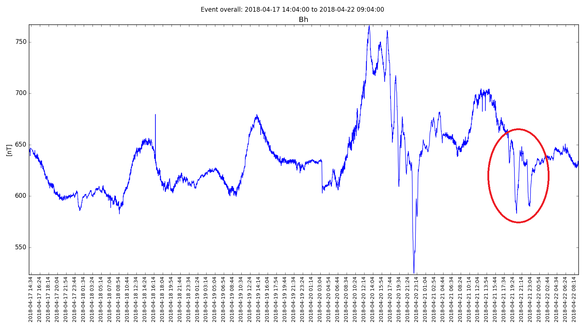
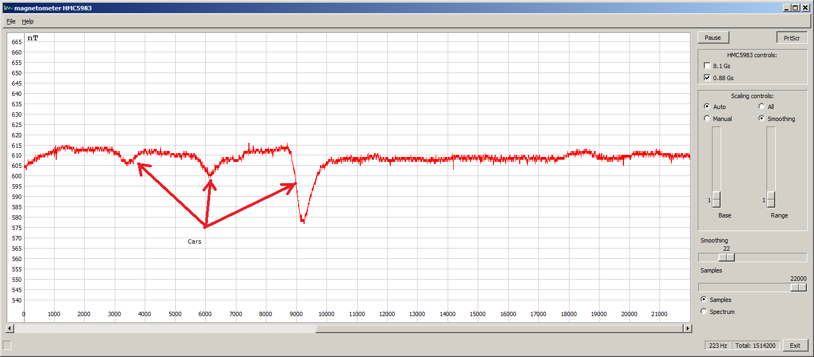
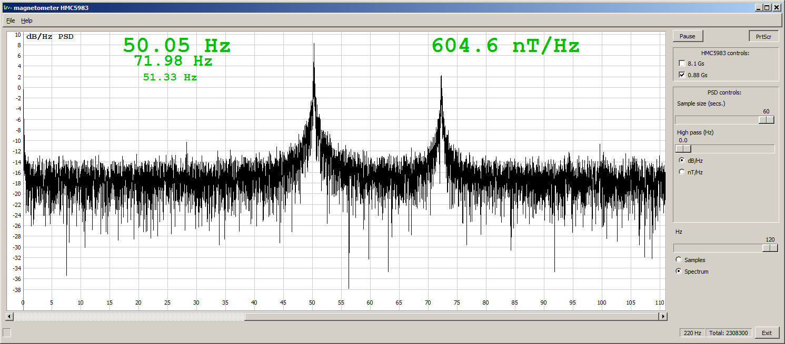
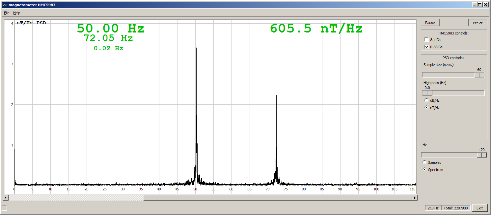
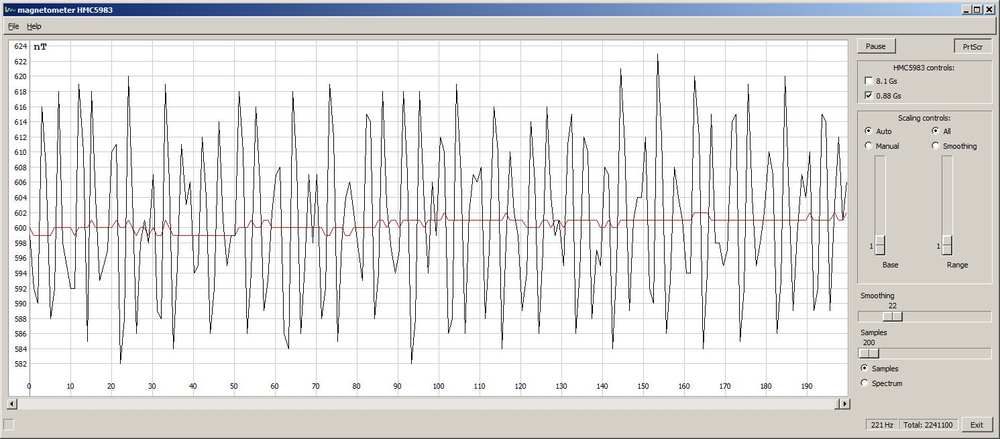
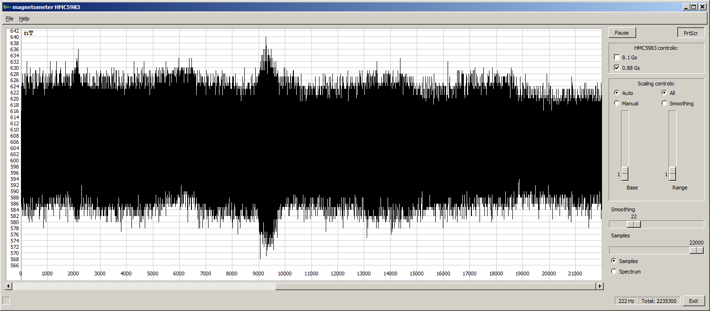
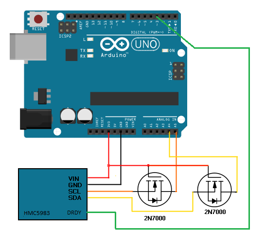
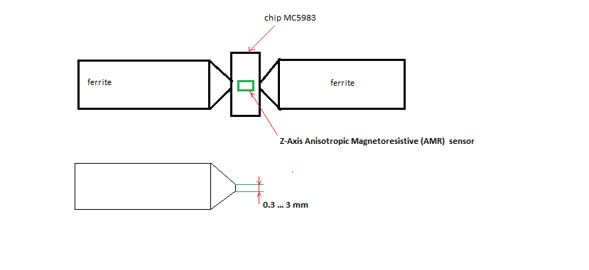
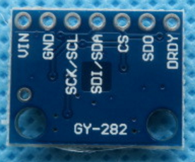

# geomagnetic-magnetometer
Real-time view of the geomagnetic field fluctuations at the YOU HOME magnetometer station.
Magnetometer provides one set of measurements of the Earth's geomagnetic field.

